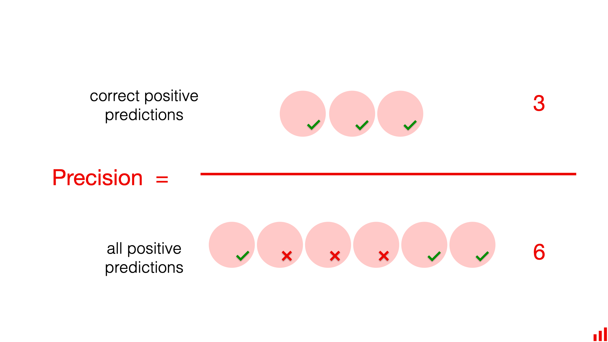
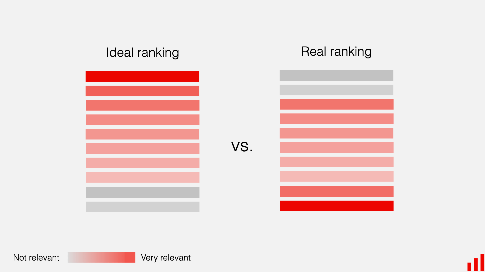
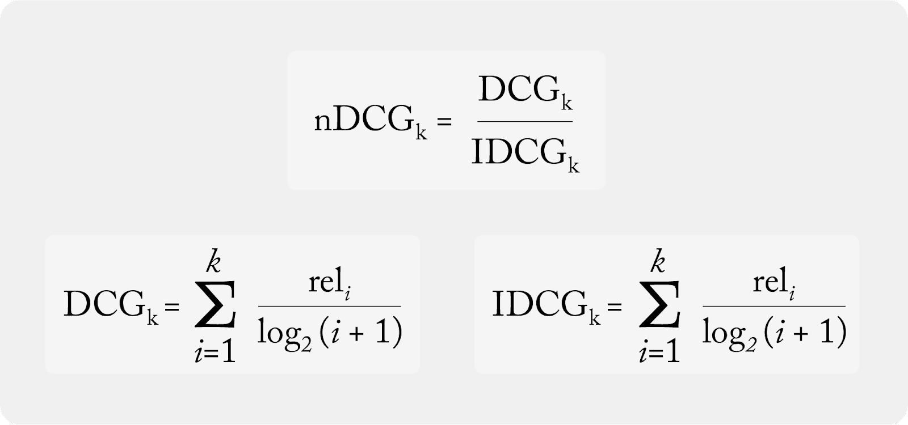

# Metrics

## Hit Rate
**`Definition`**: Hit rate is the percentage of times the correct chunk is obtained among all the chunks retrieved.


> Problem with Hit Rate: This does not take into account the position of the relevant chunk among those retrieved. In the following example we have 2 retrievers that have the same hit rate and yet retriever 2 ranks the relevant documents better (at the first position) and clearly this retriever would be more preferable: This is where the MRR (Mean Reciprocal Rank) is considered


## MRR
**`Definition`**: MRR indicates the average position of the first correct answer.

> **`Interpretation`** :
* MRR close to 1: the correct result is often at the top.
* MRR close to 0: the correct result is rarely found or is found very low in the list.


## Recall
**`Definition`**: Recall is a metric that measures how often a machine learning model correctly identifies positive instances (true positives) from all the actual positive samples in the dataset



# NDCG scores
**`Definition`**: Normalized Discounted Cumulative Gain (NDCG) is a ranking quality metric. It compares rankings to an ideal order where all relevant items are at the top of the list.

This metric is used in most of the benchmark available because of its characteristics (contains not only the informations if the documents are retrieved but also if they are highly ranked in the retrieval order).




# Extraction and generation benchmark

This folder is built to check OpenRAG's ability to extract the relevant documents and also the responses. The questions are generated based from the sources sharing the same topic.

Here are the steps to follow in order to reproduce the benchmark.

Relocate the relative path to this folder


```bash
cd ./automated-evaluation-pipeline
```

## Inserting files into the vectorize database
This will send all the files in your `pdf_files/` folder to your OpenRAG via API method (and they will be indexed automatically), so make sure that your OpenRAG is turned on first.

```bash
python upload_files.py
```

You can name the partition in the input.

## Organise all the chunks into clusters
We use the endpoint `chunks` to retrieve all the available chunks from a partition, then to organise them all into clusters (with the helps from `Umap` and `HDBSCAN`). 

For each cluster, we take a certain number of combinaisons of chunks (varies from 1 to 3) and generate questions with LLM's help (the model that you are also using for OpenRAG).

```bash
python generate_questions.py
```

All the questions are then stores in `dataset.json` with such format:

```bash
{
    "question": "Comment les conditions climatiques et les défis géopolitiques ont-ils influencé les récoltes de pois, de féveroles et d'autres protéagineux en France entre 2020 et 2022 ?",
    "chunks": [
        {
            "id": 458974149490248568,
            "text": ...,
            "file_id": "note-aux-operateurs-422.pdf"
        },
        ...
    ],
    "llm_answer": 
},
```

## Evaluation: Documents retrieval and responses

Using an OpenAI compatible client, we can retrieve the response and also the relevant documents.

Thus, by comparing the chunks' id with those stored in the .json file, we can get the nDCG score of the retrieval. For the reponse produced by the LLM, we use an LLM as a judge, to ask if the content generated has provided quality and sufficient amount of informaton or not.

Finally, we get the score by taking the mean value and also regroup the evaluations of the LLM. 

```bash
python benchmark.py
```
